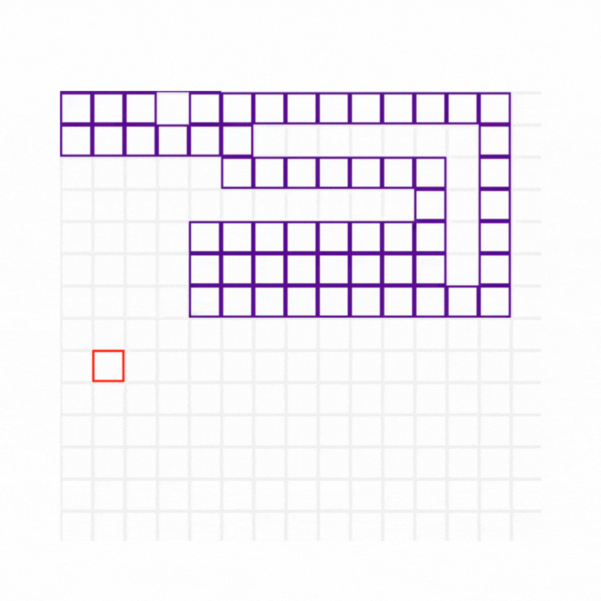

# Snake Game Simulation

A classic snake game simulation built with Python and Pygame, demonstrating fundamental game mechanics including user input, collision detection, and real-time rendering.

<br>



---

## About the Project

This project replicates the timeless Snake game where the player controls a snake to eat food items, growing longer with each successful meal.

The challenge lies in avoiding collisions with the snake’s own body or boundaries of the playing field.

---

## Features

- **Snake Movement:** Smooth and responsive control of the snake using deques as queues.
- **Food Consumption:** Snake grows in length and score increments upon eating food randomly spawned on the grid.
- **Collision Detection:** Game ends if the snake collides with itself or the game boundaries.
- **User Interface:** Displays score and game-over messages clearly on the game window.

## Technologies Used
- **Programming Language** Python
- **Game Engine:** Pygame, pygame-gui
- **Built-in Modules:** time, random, typing

## How to Run
```bash
# 1. Clone the repository
git clone https://github.com/henry-mesquita/snake-game.git

# 2. Navigate to the project directory
cd snake-game

# 3. (Optional) Create and activate a virtual environment
python -m venv venv
source venv/bin/activate # On Windows: venv\Scripts\activate

# 4. Install dependencies
pip install -r requirements.txt

# 5. Run the game
python main.py
```

## Author

Developed by **Henry Mesquita**.
